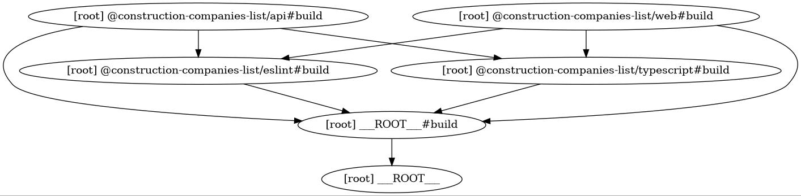

# construction-companies-list

## Preconditions
Installed node and yarn

## Start project
In the root run:
1. `yarn` (install packages)
2. `yarn dev` (run development)
3. app will open on http://localhost:3000/

## Description
Project is built as monorepo consisting of:
- apps
  - api - apollo server exposing graphql for front end
  - web - front end react app
- packages
  - eslint - shares eslint setup (just pasted as I like to use it)
  - typescript - shares tsconfig

## "In addition, make a list of ideas on how you would improve this application if you had more time to work on it"

I believe I had enough time and so the coding challenge fully meets requirements of assignment. However there would be a long list of what all should be done different or better in case of real world application. The most sever things to do could be:

- API needs error handling and cors headers.
- Web needs also error handling and error boundaries
- Components `CompaniesFilter` and `CompaniesTable` are built specifically. There should exist general reusable components for table and table filter.
- Always a good idea to use Storybook
- Filtering is done on the front end. It is not necessarily wrong for small set of data but for large set of data it should be done on the back end. Companies query should contain arguments for filtering, sorting and paging. For searching is good idea to use dedicated db like elasticsearch.
- Env variables should be used instead of hardcoded graphql url. Those need to be resolved at runtime which requires little bit more effort on the FE. 
- and more...